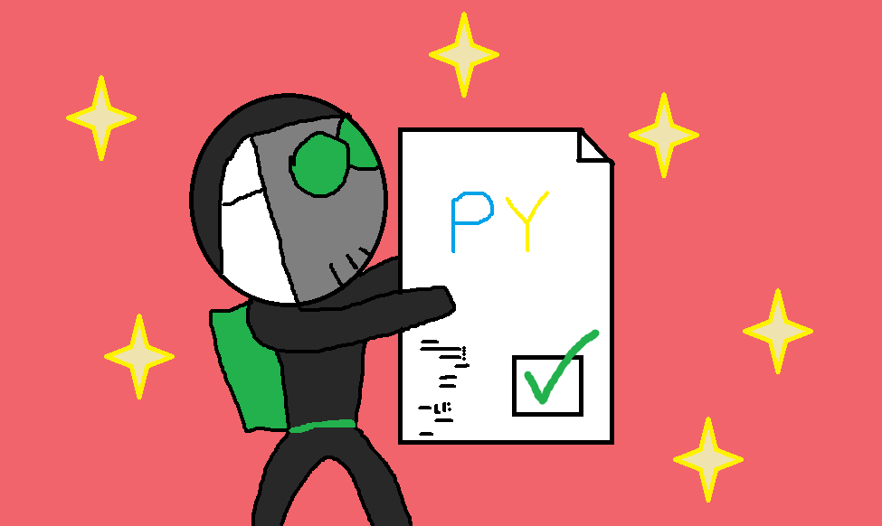

# Following a style and quality standard on your Python code

- **Article type**: Informative article
- **OS needed**: N/A
- **Programming language**: Python

## Overview

As an open-source developer, I've had the opportunity of contributing with several Python projects. But I found that, when there's not a standard
of how to write the code, the code style may look like this:

That's because each collaborator made the things on its own way, and the code looks irregular.

However, Python has defined "best practices" to keep everything as clean as possible. On this article, we'll talk about how to follow
these practices, to ensure a well-formatted code.

## PEP 8: A standard for Python code

The style guide for Python code has been defined by [PEP 8](https://pep8.org). It contains a bunch of recommendations to write your Python stuff. We are
going to take this PEP for this article as our guide.

## Use linters

It is always helpful to have tools for keeping the order in your codebase. **Linters** are tools that tell you when something in the style/quality
is deficient. I even made a drawing for this:

Some examples of linters are:

- [flake8](https://github.com/PyCQA/flake8)
- [isort](https://github.com/PyCQA/isort) (it has a mode to check deficient imports)
- [black](https://github.com/psf/black) (it has a mode to check deficient code)

## Use formatters

**Formatters** are better than linters, because they fix the bad code, instead of just crashing. Basing on the previous comic:

Some examples of formatters are:

- [black](https://github.com/psf/black)
- [isort](https://github.com/PyCQA/isort)

## Use automation tools

What can be better than formatters and linters? **Formatters and linters... together!** You can set up an automation tool to
do both things (or even more things) with less steps. Here are some examples to start:

- [pre-commit](https://pre-commit.com)
- [Nox](https://nox.thea.codes)
- [tox](https://github.com/tox-dev/tox)
- [invoke](https://www.pyinvoke.org/)

----

And this is where the article ends. I hope you like it, and maybe share this with more people. To go back to the main page of my
website, press [here](http://DiddiLeija.github.io).
